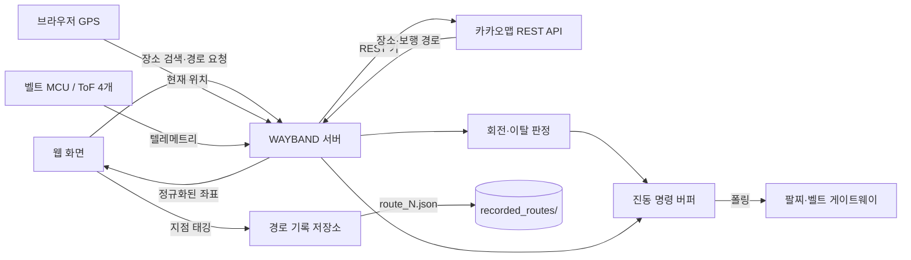

# WAYBAND 재구성 버전

시각장애인의 청각을 가리지 않으면서 보행 경로의 좌·우 회전과 주변 장애물을 진동으로 전달하기 위한 시제품입니다. 기존 `iot_example`의 카카오 장소 검색·도보 경로 호출을 유지하면서, 장소 선택, 지도 표시, GPS 기반 회전 시점 판정, 진동 명령, ToF 텔레메트리, 그리고 보호자가 직접 걸으며 경로를 태깅하는 경로 기록 모드까지 하나의 흐름으로 연결했습니다.

> 이 프로젝트는 연구·시연용 코드입니다. 흰지팡이, 안내견, 보행 교육 등 검증된 보조 수단을 대체하지 않습니다. 실제 도로 사용 전 사용자 연구, 접근성 전문가 검토, 충분한 야외 시험, 고장 안전 설계가 필요합니다.

## 구현 범위

1. 카카오 키워드 장소 검색 결과를 최대 5개 표시하고 사용자가 정확한 장소를 선택
2. 공식 카카오 도보 경로 API(`/v2/routing/walk`)를 기본 `ACCESSIBLE`(안전 경로, 계단·급경사 최소화)로 호출하고, 사용자가 원하면 `SHORTEST`(빠른 경로)도 선택 가능. 두 경로를 자동 비교해 "안전 경로는 빠른 경로보다 N m 더 길지만 계단 M곳을 피합니다" 식으로 안내
3. 경로 좌표를 카카오 지도 JavaScript SDK의 `Polyline`으로 표시
4. 단계별 안내 문구를 좌회전·우회전·유턴·횡단보도·계단·도착 등으로 분류하고, 경로에 포함된 계단·횡단보도 수를 요약 표시(안전 경로에도 계단이 남으면 경고)
5. 브라우저 GPS가 회전 지점 25m/8m 반경에 들어오면 준비/즉시 진동 명령 생성(횡단보도·계단은 준비 없이 근접 시 1회)
6. 경로에서 3회 연속 벗어나면 양쪽 팔찌 이탈 진동 명령 생성
7. 4개 ToF 센서값을 받아 벨트 방향별 경고/위험 진동 명령 생성
8. ESP32 같은 게이트웨이가 순번 기반으로 진동 명령을 가져갈 수 있는 폴링 API 제공
9. **경로 기록 모드**: 보호자가 시각장애인과 함께 실제 경로를 걸으며 좌회전·우회전·횡단보도·계단·도착 지점을 웹에서 태깅 → `recorded_routes/route_N.json`으로 저장
10. **경로 안내 모드(기록한 경로)**: 저장된 `route_N.json`을 불러와 GPS로 다음 지점까지 거리를 계산하고, 지점 유형에 맞는 진동 명령을 생성해 `/api/haptics` 버퍼에 발행
11. **위험 버튼 알림**: 시각장애인 쪽 위험 버튼(시뮬레이터)을 누르면 보호자 화면에 빨간 배너로 알림 표시 (페이지가 열려 있는 동안 4초마다 폴링)

## 전체 흐름



## 폴더 구조

```text
WAYBAND_REBUILD/
├─ app.py                     Uvicorn 진입점
├─ requirements.txt
├─ .env.example
├─ wayband/
│  ├─ api.py                  HTTP API와 웹 파일 제공
│  ├─ config.py                환경변수와 거리 기준
│  ├─ kakao.py                카카오 장소·도보 경로 요청
│  ├─ models.py                장소·경로 도메인 모델
│  ├─ route_parser.py          응답 검증·안내 분류
│  ├─ navigation.py            GPS 회전·이탈 판정
│  ├─ hazard.py                ToF 상태·히스테리시스
│  ├─ haptics.py                장치 독립 진동 명령과 버퍼
│  ├─ recording.py             경로 기록 모드(지점 태깅·route_N.json 저장)
│  └─ service.py                기능 조립과 세션 상태
├─ web/
│  ├─ index.html
│  ├─ styles.css
│  └─ app.js                  검색·지도·GPS·센서·경로 기록 UI
├─ docs/
│  └─ HARDWARE_PROTOCOL.md
├─ recorded_routes/            경로 기록 모드 산출물(route_N.json, 실행 중 생성됨)
├─ tests/                      네트워크 없는 단위 테스트 코드
└─ REVIEW_OF_IOT_EXAMPLE.md    기존 코드 검토 결과
```

## 준비 방법

아래 명령은 사용자가 실행할 때의 예시입니다.
Python 3.11 이상을 권장합니다.

```powershell
cd WAYBAND_REBUILD
py -m venv .venv
.venv\Scripts\Activate.ps1
pip install -r requirements.txt
Copy-Item .env.example .env
```

`.env`에 다음 두 키를 입력합니다.

```env
KAKAO_REST_API_KEY=서버용_REST_API_키
KAKAO_JAVASCRIPT_KEY=웹지도용_JavaScript_키
```

- REST API 키는 브라우저 코드에 넣지 않습니다.
- JavaScript 키는 웹 브라우저에 보일 수밖에 없는 키입니다. 카카오 개발자 콘솔의 JavaScript SDK 도메인에 실제 서비스 주소를 등록하고, 개발 시 `http://localhost:8000`도 등록합니다.
- `.env`는 Git에 올리지 않습니다.

## 사용자 실행 방법

```powershell
uvicorn app:app --reload --port 8000
```

브라우저에서 `http://localhost:8000`을 엽니다.

- 경로 기록 모드(화면 맨 위): 경로 이름 입력 → 기록 시작 → 걸으면서 좌회전/우회전/횡단보도/계단 버튼 태깅 → 도착 지점 저장 → 경로 저장. `recorded_routes/route_N.json`이 생성됩니다.
- 카카오 자동 경로 모드(그 아래): 장소 검색 → 후보 선택 → 경로 만들기 순서로 진행합니다.

GPS 관련 기능은 위치 권한을 허용해야 동작합니다. 일반 배포 환경에서 브라우저 위치 API는 HTTPS가 필요합니다(로컬호스트 제외).

### 휴대폰 GPS로 시험하기

휴대폰에서 노트북의 사설 IP로 `http://192.168.x.x:8000`에 접속하면 브라우저가 GPS를 차단할 수 있습니다. 개발 중에는 VS Code의 HTTPS 포트 전달 기능을 이용할 수 있습니다.

1. 외부 접속을 받을 수 있도록 서버를 실행합니다.

   ```powershell
   uvicorn app:app --reload --host 0.0.0.0 --port 8000
   ```

2. VS Code의 **PORTS(포트)** 패널에서 `8000`번 포트를 전달합니다.
3. 휴대폰에서 로그인 없이 시험하려면 포트의 **Port Visibility**를 잠시 **Public**으로 바꾸고 표시된 `https://...` 주소를 복사합니다. 공개 포트는 시험 후 즉시 중지하세요.
4. 카카오 디벨로퍼스의 해당 JavaScript 키 설정에서 HTTPS 주소의 origin을 **JavaScript SDK 도메인**으로 등록합니다. 경로와 마지막 `/`는 제외합니다.
5. 휴대폰 브라우저에서 HTTPS 주소를 열고 **현위치** → 목적지 검색·선택 → **경로 생성** → **GPS 안내 시작** 순서로 진행합니다.

**현위치**는 휴대폰 GPS 좌표를 카카오 경로 API의 출발 좌표로 사용하고, **GPS 안내 시작**은 이동 중 위치를 계속 서버에 보내 회전과 경로 이탈 여부를 갱신합니다.

단위 테스트를 실행하려면 다음 명령을 사용할 수 있습니다.

```powershell
python -m unittest discover -s tests -v
```

## 진동 의미

| 상황 | 대상 | 기본 패턴 |
|---|---|---|
| 좌회전 준비 | 왼쪽 팔찌 | 짧게 1회 |
| 지금 좌회전 | 왼쪽 팔찌 | 짧게 3회 |
| 우회전 준비 | 오른쪽 팔찌 | 짧게 1회 |
| 지금 우회전 | 오른쪽 팔찌 | 짧게 3회 |
| 유턴 | 양쪽 팔찌 | 짧게 4회 |
| 도착 | 양쪽 팔찌 | 길게 2회 |
| 경로 이탈 | 양쪽 팔찌 | 빠르게 5회 |
| ToF 경고/위험 | 감지 방향의 벨트 진동부 | 2회/빠르게 5회 |

패턴은 정답이 아니라 초기 가설입니다. 시각장애인 당사자와 반복 시험해 혼동률, 인지 시간, 피로도를 측정한 뒤 조정해야 합니다. 길 안내와 장애물 경고의 진동 위치·리듬을 분명히 다르게 유지하세요.

> 참고: 카카오 자동 경로 모드(`navigation.py`)는 좌/우/유턴/도착에 더해 횡단보도·계단 구간에도 진동을 만듭니다(횡단보도·계단은 준비 단계 없이 근접 시 1회). 계단은 안내 문구에 "계단/층계/육교/지하보도" 등이 있으면 `Maneuver.STAIRS`로 분류됩니다.

## API 요약

- `GET /api/places?query=...`: 장소 후보 검색
- `POST /api/routes`: 선택한 좌표로 경로 생성
- `POST /api/navigation/{route_id}/location`: 현재 GPS 위치 전달
- `POST /api/tof`: 4개 ToF 거리 전달
- `GET /api/haptics?after_sequence=0`: 장치가 새 진동 명령 조회
- `POST /api/recordings`: 경로 기록 시작 (이름 + 시작 좌표)
- `POST /api/recordings/{recording_id}/waypoints`: 좌회전/우회전/횡단보도/계단/도착 지점 태깅
- `GET /api/recordings/{recording_id}`: 진행 중인 기록 상태 조회
- `POST /api/recordings/{recording_id}/finish`: 기록 종료 및 `route_N.json` 저장
- `GET /api/recordings`: 저장된 경로 파일 목록
- `POST /api/recorded-routes/{route_id}/start`: 저장된 경로로 안내 세션 시작
- `POST /api/recorded-routes/{route_id}/location`: 안내 중 GPS 위치 전달 → 다음 지점 거리·진동 판정
- `POST /api/emergency`: 위험 버튼 트리거
- `GET /api/emergency`: 현재 활성화된 알림 조회
- `POST /api/emergency/{alert_id}/acknowledge`: 알림 확인 처리
- `GET /docs`: FastAPI가 생성한 상세 API 문서

장치 연결용 JSON 형식과 `route_N.json` 구조는 [HARDWARE_PROTOCOL.md](docs/HARDWARE_PROTOCOL.md)를 참고하세요.

## 중요한 기술적 한계

- 카카오 경로 응답은 `guidance` 안내 문구와 단계 시작 좌표를 주지만, 좌/우 회전을 별도의 구조화된 필드로 제공하지 않습니다. 이 버전은 한국어 문구를 우선 분류하고, 방향 표현이 없으면 경로 기하로 보조 추정합니다.
- `ACCESSIBLE`은 공식 문서상 "편안한 길" 탐색 옵션입니다. 턱, 공사 구간, 점자블록, 신호 상태까지 검증된 완전한 무장애 경로라는 뜻은 아닙니다.
- 스마트폰 GPS 오차가 8m보다 클 수 있습니다. 코드가 위치 정확도를 경로 이탈 판정에는 일부 반영하지만, 회전 판정 반경은 현장 실험으로 조정해야 합니다.
- ToF 센서는 유리, 검은 물체, 비·안개, 센서 각도, 사각지대의 영향을 받을 수 있습니다.
- 서버 메모리에 경로와 명령을 보관하므로 재시작하면 사라집니다(경로 기록 모드로 저장한 `route_N.json` 파일만 예외). 여러 서버 인스턴스나 실제 서비스에서는 Redis/DB와 사용자 인증이 필요합니다.
- 가장 중요한 장애물 경고는 네트워크 왕복을 거치지 말고 벨트 MCU에서 직접 판정·진동해야 합니다. `/api/tof`는 시연, 상태 표시, 기록용 보조 경로입니다.
- 경로 기록 모드와 경로 안내 모드 모두 현재 브라우저(휴대폰) GPS를 사용합니다. 실제로는 벨트에 내장된 GPS 모듈(NEO-6M 등)이 위치를 제공할 예정이므로, 벨트-웹 통신 방식이 정해지면 위치 출처를 교체해야 합니다.
- 경로 안내 모드는 진동 명령을 만들어 `/api/haptics` 버퍼에 쌓는 것까지만 합니다. 팔찌로 실제 BLE 전송은 아직 없습니다(HTTP 폴링 규격만 정의됨).
- 위험 버튼 알림은 보호자가 페이지를 열어둔 상태에서만 보입니다. 백그라운드 푸시(웹 푸시·알림톡·SMS)와 보호자·장애인 계정 구분은 아직 없습니다.

## 공식 문서 기준

- [카카오맵 REST API: 도보 경로 조회](https://developers.kakao.com/docs/ko/kakaomap/rest-api#route-walk)
- [카카오 지도 Web API 가이드](https://apis.map.kakao.com/web/guide/)
- [카카오 API 쿼터](https://developers.kakao.com/docs/ko/getting-started/quota)

문서는 2026-08-03에 확인했습니다. API 정책·쿼터·요금은 바뀔 수 있으므로 발표 또는 배포 전에 다시 확인하세요.
